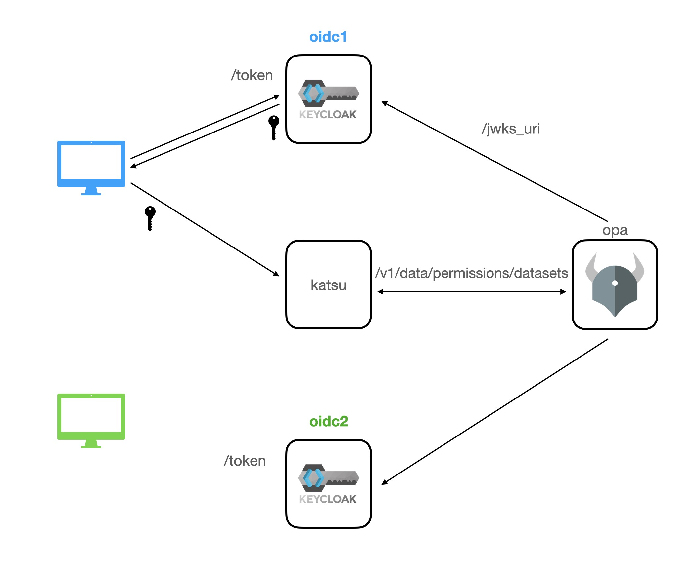

# Beacon Permissions Server



## Running

Generate internal TLS certificates, self-signed by a root CA:

```
./generate-certs.sh
```

You'll be asked for a passphrase for the signing key and to validate it, and then asked for that key twice more.
If you're asked for the subject of the first certificate, type whatever you want for country, state, and organization,
but specify `oidc` as the FQDN.

Once done, fire everything up - currently that's the IdP (Keycloak), permission engine (OPA), and fake_beacon, which
plays role of a beacon here - triggering login and requesting permissions.

```
docker-compose up -d
```

When the IdP is up and running (when `docker-compose logs oidc` shows `Admin console listening`), configure keycloak
with two users (user1 and user2); user1 is a trusted researcher with access to controlled dataset #4, and user2 is
not a trusted researcher but has access to controlled dataset #5.  It also sets up clients for the login process
and for the permissions server, which connects to the IdP's userinfo and introspection endpoints.

 ```
 ./oidc/config-oidc-service
 ```
That restarts the IdP and so will take 20 seconds or so.

Once that's done, you can "log in" to the fake beacon; it currenly returns the access token to you, which of course
isn't realistic:

```
curl "http://localhost:8000/login?username=user1&password=pass1"

```

you can capture the tokens as:

```
TOKEN1=$( curl "http://localhost:8000/login?username=user1&password=pass1" | jq .access_token | tr -d \" )
TOKEN2=$( curl "http://localhost:8000/login?username=user2&password=pass2" | jq .access_token | tr -d \" )
```

then you can have the beacon query the permissions server:

```
curl "http://localhost:8000/permissions?token=${TOKEN1}" | jq .
curl "http://localhost:8000/permissions?token=${TOKEN2}" | jq .
```

Both users can access the open data sets, only trusted researcher `user1` can access the registered datset,
and each can access their particular controlled dataset.
