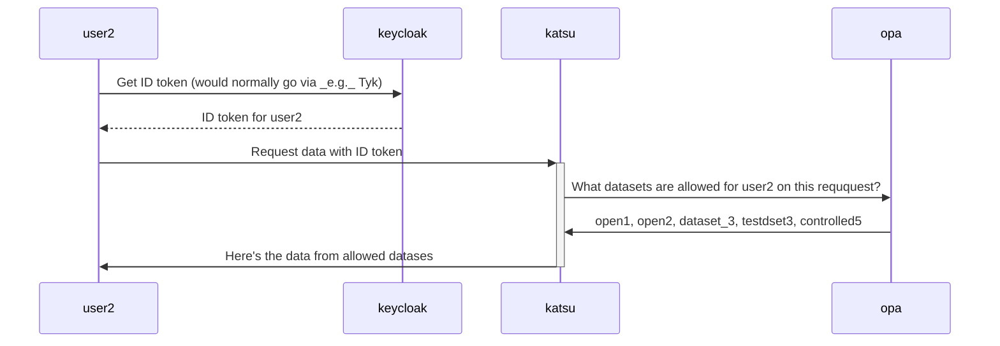

# Rego Development Playground

[](https://app.travis-ci.com/CanDIG/rego_development_playground)


## Installing dependencies on ubuntu

If you're going to be running this demo from scratch on ubuntu, you'll need to install a few things:

```
sudo apt-get update
sudo apt install -y build-essential
sudo apt install -y docker-compose python3-pip expect jq

sudo systemctl enable docker
sudo usermod -aG docker ubuntu
sudo chown $USER /var/run/docker.sock

sudo pip3 install -r tests/requirements.txt
```

## Running

### Creating all the necessary files

First let's get the files we need - we'll add the katsu submodule (and its own dependency submodules) to the current directory
```
git submodule update --init --recursive
```

And create a (temporarily empty) file in permission_engine:
```
touch permissions_engine/data.json
```

Generate internal TLS certificates, self-signed by a root CA, for internal docker networking:
```
./script_generate_certs.sh fake_key
```

### Spinning up the services

Once done, fire everything up - currently that's the two OIDC IdPs (Keycloak), permission engine (OPA) and katsu (a data service).
OPA will fail out from this because the data.json file is empty - that's perfectly fine.

```
docker-compose up -d
```

Then in Keycloak, create the realm and the users (user1 & user2 on the first IdP, user3 & user4 on the second), each with different permissions.
To do this, we need the keycloaks to be ready to connect to, which takes a long time, so we have a script that waits for them

```
./script_wait_keycloak.sh && ./oidc/config-oidc-service && ./script_wait_keycloak.sh
```

Amongst other things this restarts the IdPs and so will take 40 seconds or so.

When keycloak is up and running (when `docker-compose logs oidc` shows `Admin console listening`), it should be ready to go.

Then export environment variables for the keycloaks(OIDCs) later use in fetching keys:
```
export OIDC1="http://localhost:8080/auth/realms/mockrealm"
export OIDC2="http://localhost:8081/auth/realms/mockrealm"
export OIDC1_OPENCONNECT="http://localhost:8080/auth/realms/mockrealm/protocol/openid-connect"
export OIDC2_OPENCONNECT="http://localhost:8081/auth/realms/mockrealm/protocol/openid-connect"
```

Finally, the permissions engine (OPA) will need the keys from the now-fully-operational keycloaks to verify signatures of
tokens.  So query the keycloaks' jwk uri into `data.json ` under the directory `permissions_engine`.

```
python3 permissions_engine/fetch_keys.py
```

And with that, restart OPA so it sees the file (you can do this via OPA APIs too)
```
docker-compose restart opa
```

Finally, fill katsu with testing data by running: 
```
python3 tests/create_katsu_test_datasets.py
```

## Testing with katsu


This script creates 6 datasets *name_i*(open1, open2, registered3, controlled4, controlled5, controlled6) with one phenopacket with id *pheno_i* in each one.

Capture tokens by running: 
```
TOKEN1=$( python3 capture_token.py user1 pass1 oidc1 )
TOKEN2=$( python3 capture_token.py user1 pass1 oidc1 )
```

then you can query katsu and see what datasets you get back:

```
curl --insecure -XGET -H "X-CANDIG-LOCAL-OIDC: \"$TOKEN1\"" 'localhost:8001/api/phenopackets'|jq '.results'|jq '[.[] | {id: .id}]'
curl --insecure -XGET -H "X-CANDIG-LOCAL-OIDC: \"$TOKEN2\"" 'localhost:8001/api/phenopackets'|jq '.results'|jq '[.[] | {id: .id}]'
```
User1 should have access to 4 datasets, open1, open2, registered3 and controlled4. 
User2 should have access to 3 datasets, open1, open2, and controlled4. 

You can also do the same thing for the second keycloak
Capture tokens by running: 
```
TOKEN3=$( python3 capture_token.py user3 pass3 oidc2 )
TOKEN4=$( python3 capture_token.py user4 pass4 oidc2 )
```

then you can query katsu and see what datasets you get back:

```
curl --insecure -XGET -H "X-CANDIG-LOCAL-OIDC: \"$TOKEN3\"" 'localhost:8001/api/phenopackets'|jq '.results'|jq '[.[] | {id: .id}]'
curl --insecure -XGET -H "X-CANDIG-LOCAL-OIDC: \"$TOKEN4\"" 'localhost:8001/api/phenopackets'|jq '.results'|jq '[.[] | {id: .id}]'
```
User3 should have access to 5 datasets, open1, open2, registered3, controlled4, controlled6.
User4 should have access to 3 datasets, open1, open2, and controlled5.

What's happening here is as described below




You can also query OPA directly with a script provided:

```
./permissions_engine/test_scripts/lookup_permissions.sh ${TOKEN2}
```

And you should get the result:
```
{"result":["open1","open2","dataset_3","testdset3","controlled5"]}
```

From here you can run the tests to make sure everything works:

```
pytest tests/test_authx.py
pytest tests/katsu_tests/
```
