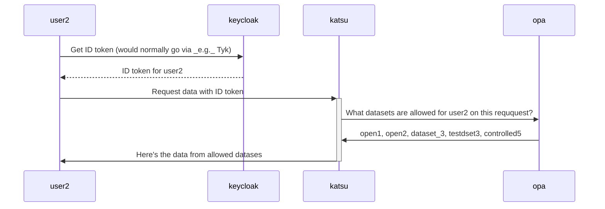

# Rego Development Playground

## Testing with katsu


This script creates 6 datasets *name_i*(open1, open2, registered3, controlled4, controlled5, controlled6) with one phenopacket with id *pheno_i* in each one.

Capture tokens by running: 
```
TOKEN1=$( python3 capture_token.py user1 pass1 oidc1 )
TOKEN2=$( python3 capture_token.py user1 pass1 oidc1 )
```

then you can query katsu and see what datasets you get back:

```
curl --insecure -XGET -H "X-CANDIG-LOCAL-OIDC: \"$TOKEN1\"" 'localhost:8001/api/phenopackets'|jq '.results'|jq '[.[] | {id: .id}]'
curl --insecure -XGET -H "X-CANDIG-LOCAL-OIDC: \"$TOKEN2\"" 'localhost:8001/api/phenopackets'|jq '.results'|jq '[.[] | {id: .id}]'
```
User1 should have access to 4 datasets, open1, open2, registered3 and controlled4. 
User2 should have access to 3 datasets, open1, open2, and controlled4. 

You can also do the same thing for the second keycloak
Capture tokens by running: 
```
TOKEN3=$( python3 capture_token.py user3 pass3 oidc2 )
TOKEN4=$( python3 capture_token.py user4 pass4 oidc2 )
```

then you can query katsu and see what datasets you get back:

```
curl --insecure -XGET -H "X-CANDIG-LOCAL-OIDC: \"$TOKEN3\"" 'localhost:8001/api/phenopackets'|jq '.results'|jq '[.[] | {id: .id}]'
curl --insecure -XGET -H "X-CANDIG-LOCAL-OIDC: \"$TOKEN4\"" 'localhost:8001/api/phenopackets'|jq '.results'|jq '[.[] | {id: .id}]'
```
User3 should have access to 5 datasets, open1, open2, registered3, controlled4, controlled6.
User4 should have access to 3 datasets, open1, open2, and controlled5.

What's happening here is as described below




You can also query OPA directly with a script provided:

```
./permissions_engine/test_scripts/lookup_permissions.sh ${TOKEN2}
```

And you should get the result:
```
{"result":["open1","open2","dataset_3","testdset3","controlled5"]}
```

From here you can run the tests to make sure everything works:

```
pytest tests/test_authx.py
pytest tests/katsu_tests/
```
